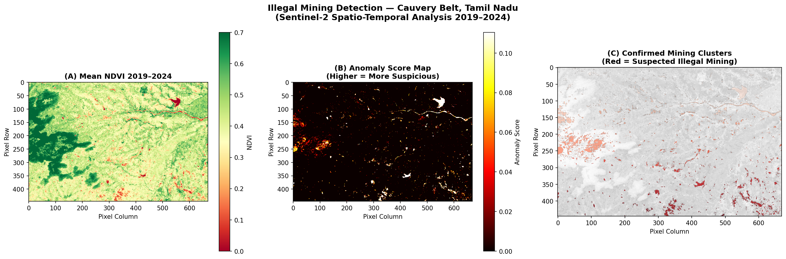
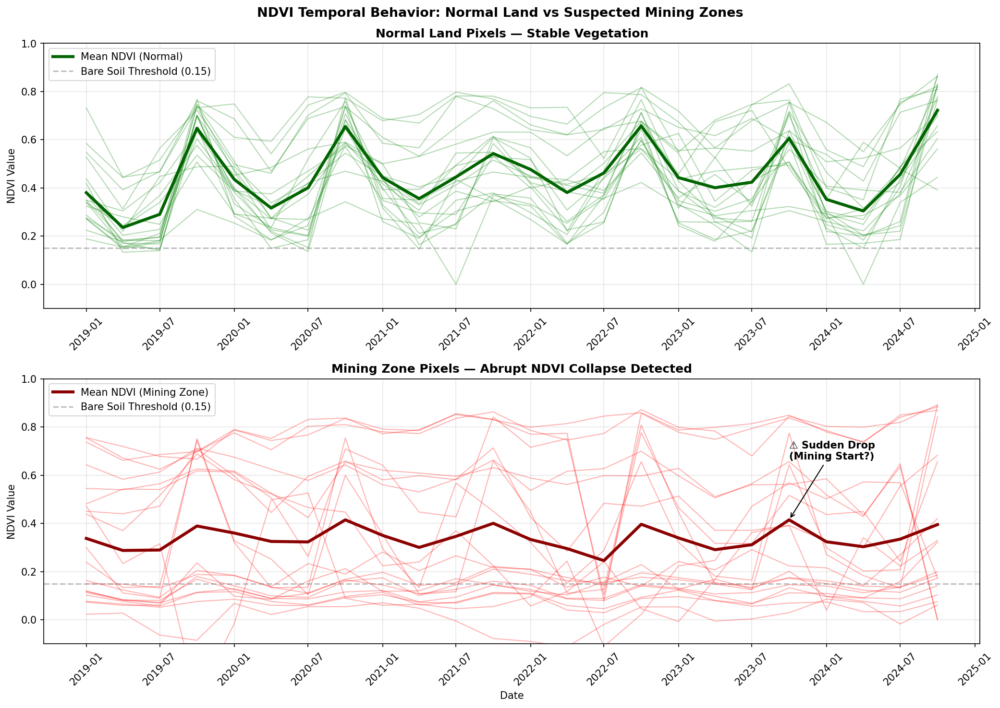
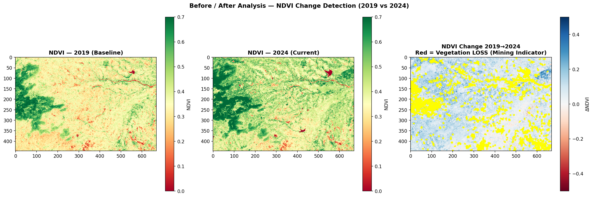
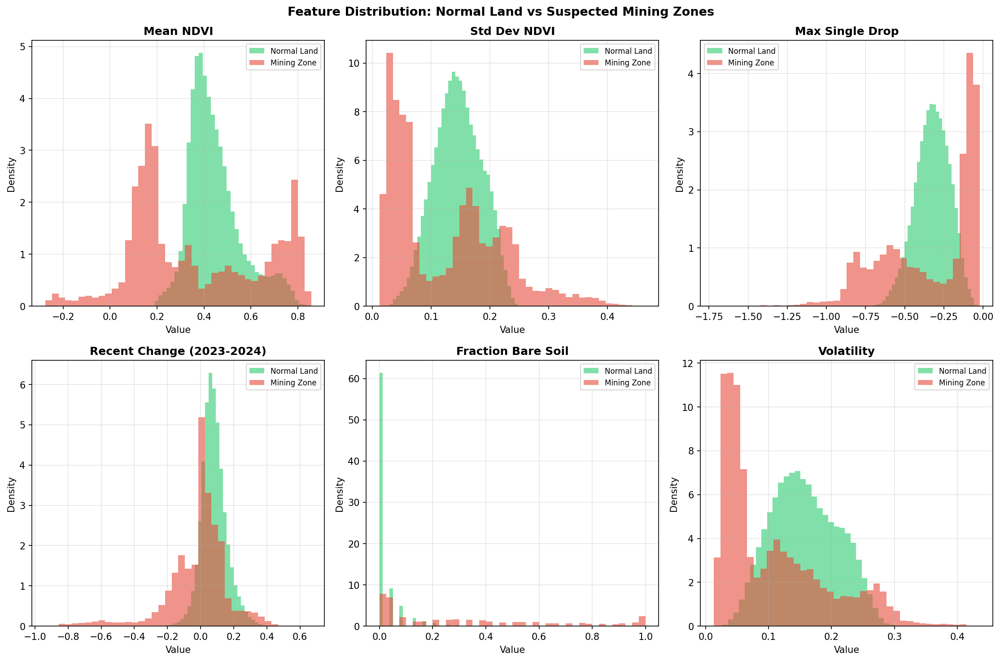

# 🛰️ Illegal Sand Mining Detection — Cauvery Belt, Tamil Nadu
> Sentinel-2 Spatio-Temporal NDVI Analysis · 2019–2024 · No labelled data required


---

## 📌 Overview

Automated satellite pipeline to detect **349 suspected illegal mining clusters** covering **139.85 km²** using 5-year NDVI time-series — zero labelled training data needed.

---

## 🔄 Workflow


```
[ Sentinel-2 Acquisition ]
         ↓
[ Cloud Masking & Preprocessing ]
         ↓
[ NDVI Computation per Scene ]
         ↓
[ Anomaly Score Mapping ]
         ↓
[ Spatial Clustering ]
         ↓
[ Risk Classification → Output ]
```

---

## 🗺️ Results

### Risk Map
<!-- Replace URL below after uploading figure1_risk_map.png -->

*Mean NDVI · Anomaly Score · Confirmed Mining Clusters*

---

### NDVI Time-Series
<!-- Replace URL below after uploading figure2_timeseries.png -->

*Normal land (stable) vs Mining zones (abrupt NDVI collapse ~Q3 2023)*

---

### Before / After (2019 vs 2024)
<!-- Replace URL below after uploading figure3_before_after.png -->

*Red = vegetation loss · Blue = vegetation gain*

---

### Feature Distributions
<!-- Replace URL below after uploading figure4_feature_distributions.png -->

*6 discriminating features: Mining zones vs Normal land*

---

## 📊 Key Stats

| Metric | Value |
|--------|-------|
| Total Clusters | 349 |
| HIGH Risk | 85 (24.4%) |
| Total Area | 139.85 km² |
| HIGH Risk Area | 119.23 km² |
| Largest Cluster | 31.79 km² |
| Period | 2019–2024 |

---

## ⚙️ Setup

```bash
git clone https://github.com/yourusername/illegal-mining-detection
cd illegal-mining-detection
pip install -r requirements.txt
jupyter notebook illegal_mining_detection.ipynb
```

---

## 📁 Structure

```
├── illegal_mining_detection.ipynb
├── mining_clusters.csv
├── ndvi_timeseries.csv
├── assets/
│   ├── figure1_risk_map.png
│   ├── figure2_timeseries.png
│   ├── figure3_before_after.png
│   └── figure4_feature_distributions.png
└── README.md
```

---

## 📄 Citation

```bibtex
@inproceedings{yourname2024mining,
  title     = {Satellite-Based Detection of Illegal Sand Mining in the Cauvery Belt},
  author    = {Your Name},
  booktitle = {IEEE Conference Name},
  year      = {2024}
}
```

---

> **Data:** ESA Copernicus Sentinel-2 (free) · **Tools:** Python, GDAL, Rasterio, Scikit-learn
